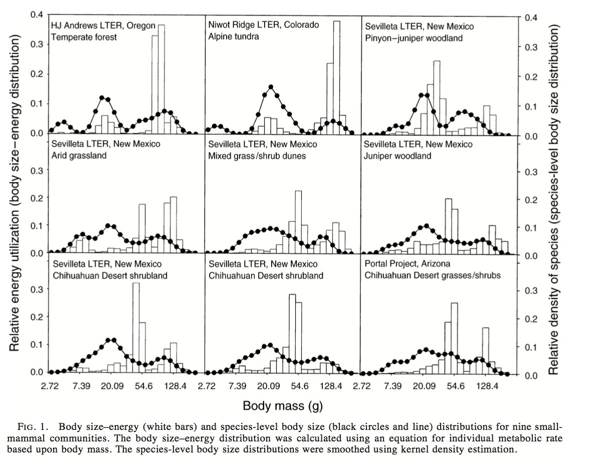

Narrative of original analysis
================
Renata Diaz
5/14/2019

A walkthrough of Ernest (2005)'s original analytical approach, from close reading of the paper.

Questions
---------

1.  Is energy use across body size categories (regardless of species) uniform or multimodal?

-   uniform would correspond generally to energetic equivalence/Damuth's rule.
-   multimodal might suggest different resource availability for different body sizes.

1.  If energy use is not uniform across body size categories, does the species level body size distribution correspond to modes of energy use?

-   i.e. are there more species with mean body sizes around the modes of the body size-energy use distribution?
-   if so, maybe it's good to be certain sizes, and species accumulate at those optima.

Data
----

#### Ernest data

Ernest drew data from the Andrews LTER, the Sevilleta, Niwot Ridge, and Portal.

The data available online do not quite match the descriptive statistics reported in Ernest (2005).

#### Translation to `replicate-becs`

Download raw data. By default data will be stored in subdirectories of `replicate-becs/data/paper/raw/` for each site.

``` r
download_raw_paper_data()
```

Process raw data into the appropriate format. This is a data table with a record for each individual and columns for `species` and `weight` in grams. By default these tables will be stored in subdirectores of `replicate-becs/data/paper/processed`.

``` r
process_raw_data()
```

    ## Loading in data version 1.106.0

    ## [1] TRUE

Load data tables for each community. There should be 9 communities.

``` r
communities <- load_paper_data()

length(communities)
```

    ## [1] 9

Each community should be a data table with columns for species and size for each individual, for example:

``` r
names(communities)
```

    ## [1] "andrews"      "niwot"        "portal"       "sev-5pgrass" 
    ## [5] "sev-5plarrea" "sev-goatdraw" "sev-rsgrass"  "sev-rslarrea"
    ## [9] "sev-two22"

``` r
head(communities[[1]])
```

    ##   individual_species_ids individual_sizes
    ## 1                   SOTR              4.0
    ## 2                   PEMA             16.5
    ## 3                   GLSA            167.0
    ## 4                   MIOR             13.0
    ## 5                   PEMA             14.0
    ## 6                   GLSA            142.0

Constructing distributions/metrics
----------------------------------

### Body size-energy use distributions (BSED)

#### Ernest method

-   Per individual, calculate metabolic rate as metabolic rate $B \\propto M^\\frac{3}{4}$ where *M* is mass in grams.
-   Sum energy use of all individuals in body size classes of .2 natural log units.
-   Also try classes of .1 and .3 natural log units
-   Convert raw energy use values for each body size class into the proportion of all the energy used in that community used by that body size class. This allows for comparisons between communities.



#### Translation to `replicate-becs`

For every individual, calculate metabolic rate and assign to a size class.

``` r
communities_energy <- lapply(communities, FUN = make_community_table, ln_units = 0.2)

head(communities_energy[[1]])
```

    ##   individual_species_ids individual_sizes individual_energy size_class
    ## 1                   SOTR              4.0          2.828427        1.2
    ## 2                   PEMA             16.5          8.186777        2.8
    ## 3                   GLSA            167.0         46.455523        5.0
    ## 4                   MIOR             13.0          6.846325        2.4
    ## 5                   PEMA             14.0          7.237624        2.6
    ## 6                   GLSA            142.0         41.135451        4.8
    ##   size_class_g
    ## 1     3.320117
    ## 2    16.444647
    ## 3   148.413159
    ## 4    11.023176
    ## 5    13.463738
    ## 6   121.510418

For each community, sum total energy use for each size class, and convert to the proportion of total energy use for that community.

``` r
bseds <- lapply(communities_energy, FUN = make_bsed)

head(bseds[[1]])
```

    ## # A tibble: 6 x 4
    ##   size_class size_class_g total_energy total_energy_proportional
    ##        <dbl>        <dbl>        <dbl>                     <dbl>
    ## 1        0.6         1.82         1.68                  0.000211
    ## 2        1           2.72        20.6                   0.00259 
    ## 3        1.2         3.32       239.                    0.0301  
    ## 4        1.4         4.06        49.4                   0.00621 
    ## 5        1.6         4.95       195.                    0.0246  
    ## 6        1.8         6.05        21.1                   0.00265


### Species-level body size distributions (BSD)

#### Ernest method

-   Frequency distributions of mean mass of each species in a community.
-   For plotting (but not statistics), smoothed using kernel density estimation.
-   Gaussian kernel to mimic the actual body size distribution in log space
-   avg. std dev of the mean of the logged masses = smoothing parameter *h*
-   align sampling points with the midpoint of each size class in the BSED
-   after Manly 1996, "Are there clumps in body-size distributions?", *Ecology*

#### Translation to `replicate-becs`

Calculate mean mass of each species in each community.

``` r
bsds <- lapply(communities, FUN = make_bsd) 

head(bsds[[1]])
```

    ## # A tibble: 6 x 6
    ##   individual_specie… species_mean_ma… ln_mass size_class size_class_g stdev
    ##   <chr>                         <dbl>   <dbl>      <dbl>        <dbl> <dbl>
    ## 1 CLCA                           17.9    2.88        2.8        16.4   1.19
    ## 2 GLSA                          117.     4.76        4.6        99.5   1.19
    ## 3 MIOR                           14.9    2.70        2.6        13.5   1.19
    ## 4 NEGI                            6.5    1.87        1.8         6.05  1.19
    ## 5 PEMA                           14.9    2.70        2.6        13.5   1.19
    ## 6 SCOR                           54.4    4.00        3.8        44.7   1.19


### Energetic dominance (*D*<sub>*E*</sub>)

-   Define "energy use modes" as contiguous body size classes where the energy use of each size class &gt; 5% of the community total.
-   i.e. a little bit more than the expectation if energy use is uniform across all body sizes
-   RMD is unsure of this. Doesn't the uniform expectation depend on the number of size classes?
-   Calculate the total energy use for each species in the mode.
-   Calculate the "dominance" of the species with the highest energy use in that mode as *D*<sub>*E*</sub> = *p*<sub>*m**a**x*</sub>, where *p*<sub>*m**a**x*</sub> is the maximum proportion of energy use by any one species in a mode.
-   "a modification of the Berger-Parker dominance index (Berger and Parker 1970)"

#### Translation to `replicate-becs`

-   Find contiguous size classes where each class has &gt;5% of total energy use
-   Calculate the total energy use for each species, and the proportion held by the species with the highest energy use (*p*<sub>*m**a**x*</sub>)
-   Return *p*<sub>*m**a**x*</sub> for every mode, along with the min and max size classes in that mode for each community

``` r
energetic_dom <- lapply(communities_energy, FUN = energetic_dominance) 

head(energetic_dom[[1]])
```

    ## # A tibble: 3 x 4
    ##   mode_id e_dominance size_class_min size_class_max
    ##     <dbl>       <dbl>          <dbl>          <dbl>
    ## 1       1       0.766            2.4            3  
    ## 2       2       1                4.4            4.4
    ## 3       3       0.979            4.8            5

-   To plot, combine all modes from all communities and plot a histogram of *D*<sub>*E*</sub> values.


-   Out of curiousity, what happens if we define the modes with the cutoff proportional to the number of size classes (instead of a fixed 5%?)

``` r
energetic_dom_prop <- lapply(communities_energy, FUN = energetic_dominance, mode_cutoff = 'prop') 
```


-   RMD: They're similar.

Statistical tests
-----------------

### Comparing BSEDs to uniform

#### Ernest approach

-   Use bootstrap sampling to compare to uniform distributions.
-   For every community, draw 10000 samples (sim communities):
-   Same number of individuals as the empirical community, drawn from a uniform distribution ranging from the smallest to largest ~~body size~~ individual metabolic rate of any individual in that community.
-   For sim communities and the empirical community, calculate a distribution overlap index (*D**O**I*):
-   *D**O**I* = ∑<sub>*k*</sub>|*y*<sub>*a**k*</sub> − *y*<sub>*b**k*</sub>| where *y* is the value for size class *k* in communities *a* and *b*.
-   *D**O**I* values will range from 0 (complete overlap) to 2 (no overlap).
-   For the BSED bootstraps, community *a* is the empirical or sim distribution, and community *b* is a true uniform distribution ~~(i.e. $y\_{bk} = \\frac{1}{\\max(k)}$ for all *k*)~~
-   "True uniform distribution": There are exactly the same number of individuals of every size.
-   Calculate the *D**O**I* for all sim communities and the empirical.
-   Find the quantile value for the empirical *D**O**I* compared to the distribution of sim *D**O**I*s. This is the p-value; i.e. the proportion of sim uniform distributions with DOIs greater than the empirical.

#### Translation to `replicate-becs`

-   For a given empirical community, draw 10000 sim communities each with the same number of individuals *n*, with body sizes randomly drawn from a uniform distribution from the minimum to maximum body size in that community.
-   Calculate the *D**O**I* of each sim community compared to a true uniform distribution.
-   True uniform distribution = every size from the minimum to the maximum size in the community (by .1g) has exactly one individual.

``` r
bsed_uniform_bootstraps <- lapply(communities, FUN = community_bootstrap,  bootstrap_function = 'bootstrap_unif_bsed_doi', nbootstraps = 10)
```

*See issue \#4 on github.*


### Compare BSEDs among communities

#### Ernest approach

-   For every pair of communities, create a pool of masses of all individuals from both communities.
-   Draw two new communities with the same number of individuals as the empirical communities, pulling masses at random from the pool, with replacement.
-   Calculate the DOI for the BSEDs of the two sample communities.
-   Repeat 10000 for each pair.
-   The P value is the proportion of sample DOIs greater (i.e. less overlap) than the empirical value.

#### Translation to `replicate-becs`

-   For every pair of communities, pool all the masses
-   Resample two communities of the right sizes
-   Construct BSEDs for both communities
-   Calculate the DOI of the two BSEDs
-   Repeat 10000x

``` r
community_combination_indices = utils::combn(x = c(1:9), m = 2, simplify = TRUE) %>%
  t() %>%
  as.data.frame() %>%
  dplyr::rename(community_a = V1, community_b = V2)

combine_communities = function(indices, communities) {
  community_combination = list(community_a = communities[[indices[1]]], community_b = communities[[indices[2]]], community_names = c(names(communities)[[indices[1]]], names(communities)[[indices[2]]]))
  
  return(community_combination)
}

community_combinations = apply(community_combination_indices, MARGIN = 1, FUN = combine_communities, communities = communities)
```

``` r
bsed_crosscomm_bootstraps = lapply(community_combinations, FUN = community_bootstrap, 
                                   bootstrap_function = 'bootstrap_crosscomm_bseds', nbootstraps = 10)
```


See histogram of p values for comparisons to see if commuities' BSEDs are the same or different.

### Testing BSDs for uniformity

#### Matching communities

Ernest (2005) refers to the communities with the `site` column above. To compare the communities above to the communities in the resurrected data set, we can try to match them based on the BSD and BSED plots (above) and species richness.

``` r
ernest_richness = read.csv(here::here("ernest-2005-files/ernest_richness.csv"), stringsAsFactors = F)

# Guesses based on body size plots
ernest_richness$community_name <- c('andrews', 'niwot', 'portal', 'sev-5pgrass', 
                                    'sev-rsgrass', 'sev-two22', 'sev-goatdraw', 
                                    'sev-5plarrea', 'sev-rslarrea')


bsds_richness = data.frame(community_name = names(bsds), stringsAsFactors = F)
bsds_richness$new_richness = NA
for(i in 1:nrow(bsds_richness)){
  bsds_richness$new_richness[i] = nrow(bsds[[i]])
}

# See if the richness values match
ernest_richness = ernest_richness %>%
  dplyr::left_join(bsds_richness, by = 'community_name') %>%
  dplyr::mutate(richness_match = (richness == new_richness))

print(ernest_richness)
```

    ##                 site richness community_name new_richness richness_match
    ## 1            andrews        9        andrews            9           TRUE
    ## 2              niwot       11          niwot           11           TRUE
    ## 3             portal       21         portal           19          FALSE
    ## 4          sev grass       18    sev-5pgrass           15          FALSE
    ## 5    sev grass shrub       20    sev-rsgrass           18          FALSE
    ## 6        sev juniper       21      sev-two22           18          FALSE
    ## 7 sev pinyon juniper       12   sev-goatdraw           12           TRUE
    ## 8          sev shrub       18   sev-5plarrea           15          FALSE
    ## 9        sev shrub 2       20   sev-rslarrea           20           TRUE

We can get 2 (of 7) communities at the Sevilleta to match up, and Niwot and Andrews. The other pairings are as close as possible.

Moving forward, we can compare the results of the Kolmogorov-Smirnov tests based on the values in the appendix and these name pairings.

``` r
ernest_key = ernest_richness %>%
  dplyr::select(site, community_name)

write.csv(ernest_key, file = here::here('ernest-2005-files/ernest_key.csv'), row.names = F)
```

#### Ernest approach

-   *δ*-corrected Kolmogorov-Smirnov test.
-   "The *δ*-corrected K-S test increases the power of the test when sample sizes are small (n &lt; 25; Zar 1999)"
-   The *δ*-corrected test is not widely discussed online.

``` r
ernest_bsds_uniform_results = read.csv(here::here('ernest-2005-files/ernest_appendixA.csv'), stringsAsFactors = F) %>%
  dplyr::left_join(ernest_key, by = 'site')
print(ernest_bsds_uniform_results)
```

    ##                 site sample.size     d delta p_min p_max signif
    ## 1            andrews           9 0.210     1   0.5   1.0  FALSE
    ## 2              niwot          11 0.290     1   0.1   0.2  FALSE
    ## 3             portal          21 0.090     1   0.5   1.0  FALSE
    ## 4          sev grass          18 0.175     0   0.2   0.5  FALSE
    ## 5    sev grass shrub          20 0.102     0   0.5   1.0  FALSE
    ## 6        sev juniper          21 0.115     0   0.5   1.0  FALSE
    ## 7 sev pinyon juniper          12 0.120     0   0.5   1.0  FALSE
    ## 8          sev shrub          18 0.189     0   0.2   0.5  FALSE
    ## 9        sev shrub 2          20 0.137     0   0.5   1.0  FALSE
    ##   community_name
    ## 1        andrews
    ## 2          niwot
    ## 3         portal
    ## 4    sev-5pgrass
    ## 5    sev-rsgrass
    ## 6      sev-two22
    ## 7   sev-goatdraw
    ## 8   sev-5plarrea
    ## 9   sev-rslarrea

#### Translation to `replicate-becs`:

*From Zar (1999) *Biostatistical Analysis*.*

##### Base K-S test

-   Take vector of measurements *X*<sub>*i*</sub>.
-   For each *X*<sub>*i*</sub> record the observed frequency *f*<sub>*i*</sub> (number of observations with that value).
-   Determine cumulative observed frequencies *F*<sub>*i*</sub> and cumulative relative frequencies rel*F*<sub>*i*</sub>:
-   $\\textrm{rel}F\_i = \\frac{F\_i}{n}$ where *n* is the number of measurements taken.
-   rel*F*<sub>*i*</sub> is the proportion of the sample that is measurements ≤*X*<sub>*i*</sub>.
-   For each *X*<sub>*i*</sub>, determine the cumulative *relative* expected frequency from the comparison distribution, $\\textrm{rel}\\hat{F\_i}$.
-   For a uniform distribution, $\\textrm{rel}\\hat{F\_i} = \\frac{X\_i - \\min(X)}{\\max(X) - \\min(X)}$
-   Determine *D*<sub>*i*</sub> and *D*′<sub>*i*</sub> as:
-   $D\_i = |{\\textrm{rel}F\_i - \\textrm{rel}\\hat{F\_i}}|$
-   $D'\_i = |{\\textrm{rel}F\_{i-1} - \\textrm{rel}\\hat{F\_i}}|$
-   note *F*<sub>0</sub> = 0 so $D'\_1 = \\textrm{rel}\\hat{F\_i}$
-   The test statistic *D* is:
-   *D* = max\[(max(*D*<sub>*i*</sub>),(max(*D*′<sub>*i*</sub>)\]
-   Compare to critical values from appendix.

##### *δ*-corrected KS test

-   For small sample sizes (&lt;25) we can obtain increased power using the *δ*-corrected KS test.
-   For each *i* determine
-   $\\textrm{rel}G\_i = \\frac{F\_i}{n + 1}$
-   $\\textrm{rel}G'\_i = \\frac{F\_i - 1}{n - 1}$
-   Then obtain similar *D*s
-   $D\_{0, i} = |\\textrm{rel}G\_i - \\textrm{rel}\\hat{F\_i}|$
-   $D\_{1, i} = |\\textrm{rel}G'\_i - \\textrm{rel}\\hat{F\_i}|$
-   The test statistic is either max(*D*<sub>0, *i*</sub>) or max(*D*<sub>1, *i*</sub>), whichever leads to the highest level of significance/smallest probability. Look up significance in table from appendix. The 1 and 0 are the *δ*s.

Tables of critical values were entered by hand from the appendix to Zar (1999).

    ##   community_name signif.x p_max.x p_min.x d_statistic               site
    ## 1        andrews     TRUE    0.02       0   0.4824239            andrews
    ## 2          niwot     TRUE    0.02       0   0.6140682              niwot
    ## 3         portal     TRUE    0.02       0   0.4946621             portal
    ## 4    sev-5pgrass     TRUE    0.02       0   0.3893173          sev grass
    ## 5   sev-5plarrea     TRUE    0.02       0   0.4624160          sev shrub
    ## 6   sev-goatdraw     TRUE    0.02       0   0.3881576 sev pinyon juniper
    ## 7    sev-rsgrass     TRUE    0.02       0   0.4672033    sev grass shrub
    ## 8   sev-rslarrea     TRUE    0.02       0   0.4343417        sev shrub 2
    ## 9      sev-two22     TRUE    0.02       0   0.5084637        sev juniper
    ##   sample.size     d delta p_min.y p_max.y signif.y
    ## 1           9 0.210     1     0.5     1.0    FALSE
    ## 2          11 0.290     1     0.1     0.2    FALSE
    ## 3          21 0.090     1     0.5     1.0    FALSE
    ## 4          18 0.175     0     0.2     0.5    FALSE
    ## 5          18 0.189     0     0.2     0.5    FALSE
    ## 6          12 0.120     0     0.5     1.0    FALSE
    ## 7          20 0.102     0     0.5     1.0    FALSE
    ## 8          20 0.137     0     0.5     1.0    FALSE
    ## 9          21 0.115     0     0.5     1.0    FALSE

The *δ* corrected KS test does not correspond to the results from Ernest when the species mean body size values are on an untransformed scale.

Using the natural log of the species mean body size value, however...:

    ##   community_name signif.x p_max.x p_min.x d_statistic               site
    ## 1        andrews    FALSE     1.0     0.5   0.1398433            andrews
    ## 2          niwot    FALSE     0.5     0.1   0.2973462              niwot
    ## 3         portal    FALSE     1.0     0.5   0.1436705             portal
    ## 4    sev-5pgrass    FALSE     1.0     0.5   0.1252882          sev grass
    ## 5   sev-5plarrea    FALSE     0.5     0.1   0.2037134          sev shrub
    ## 6   sev-goatdraw    FALSE     1.0     0.5   0.1327084 sev pinyon juniper
    ## 7    sev-rsgrass    FALSE     1.0     0.5   0.1617653    sev grass shrub
    ## 8   sev-rslarrea    FALSE     1.0     0.5   0.1415647        sev shrub 2
    ## 9      sev-two22    FALSE     1.0     0.5   0.1663774        sev juniper
    ##   sample.size     d delta p_min.y p_max.y signif.y
    ## 1           9 0.210     1     0.5     1.0    FALSE
    ## 2          11 0.290     1     0.1     0.2    FALSE
    ## 3          21 0.090     1     0.5     1.0    FALSE
    ## 4          18 0.175     0     0.2     0.5    FALSE
    ## 5          18 0.189     0     0.2     0.5    FALSE
    ## 6          12 0.120     0     0.5     1.0    FALSE
    ## 7          20 0.102     0     0.5     1.0    FALSE
    ## 8          20 0.137     0     0.5     1.0    FALSE
    ## 9          21 0.115     0     0.5     1.0    FALSE

With mean mass logged, all the results replicate qualitatively (i.e. not significantly different from uniform) and Niwot, for which the currently-available data most closely matches that reported in Ernest (2005), replicates almost exactly numerically.

### Comparing BSDs among communities

#### Ernest approach

Ernest (2005) used a two-sample Kolmogorov-Smirnov test to compare every possible combination of community-level BSDs.

    ##                site_a          site_b max_d ernest_p_val  community_a
    ## 1  sev pinyon juniper       sev grass 1.940        0.948 sev-goatdraw
    ## 2  sev pinyon juniper       sev shrub 0.222        0.869 sev-goatdraw
    ## 3           sev grass       sev shrub 0.167        0.964  sev-5pgrass
    ## 4  sev pinyon juniper     sev shrub 2 0.150        0.996 sev-goatdraw
    ## 5           sev grass     sev shrub 2 0.172        0.941  sev-5pgrass
    ## 6           sev shrub     sev shrub 2 0.161        0.967 sev-5plarrea
    ## 7  sev pinyon juniper sev grass shrub 0.150        0.996 sev-goatdraw
    ## 8           sev grass sev grass shrub 0.211        0.792  sev-5pgrass
    ## 9           sev shrub sev grass shrub 0.261        0.538 sev-5plarrea
    ## 10        sev shrub 2 sev grass shrub 0.150        0.978 sev-rslarrea
    ## 11 sev pinyon juniper     sev juniper 0.155        0.993 sev-goatdraw
    ## 12          sev grass     sev juniper 0.151        0.980  sev-5pgrass
    ## 13          sev shrub     sev juniper 0.183        0.903 sev-5plarrea
    ## 14        sev shrub 2     sev juniper 0.105        1.000 sev-rslarrea
    ## 15    sev grass shrub     sev juniper 0.112        1.000  sev-rsgrass
    ## 16 sev pinyon juniper          portal 0.155        0.993 sev-goatdraw
    ## 17          sev grass          portal 0.230        0.684  sev-5pgrass
    ## 18          sev shrub          portal 0.238        0.642 sev-5plarrea
    ## 19        sev shrub 2          portal 0.171        0.924 sev-rslarrea
    ## 20    sev grass shrub          portal 0.112        1.000  sev-rsgrass
    ## 21        sev juniper          portal 0.143        0.983    sev-two22
    ## 22 sev pinyon juniper           niwot 0.235        0.910 sev-goatdraw
    ## 23          sev grass           niwot 0.242        0.817  sev-5pgrass
    ## 24          sev shrub           niwot 0.227        0.872 sev-5plarrea
    ## 25        sev shrub 2           niwot 0.218        0.888 sev-rslarrea
    ## 26    sev grass shrub           niwot 0.259        0.727  sev-rsgrass
    ## 27        sev juniper           niwot 0.199        0.937    sev-two22
    ## 28             portal           niwot 0.247        0.772       portal
    ## 29 sev pinyon juniper         andrews 0.278        0.822 sev-goatdraw
    ## 30          sev grass         andrews 0.167        0.996  sev-5pgrass
    ## 31          sev shrub         andrews 0.222        0.928 sev-5plarrea
    ## 32        sev shrub 2         andrews 0.194        0.973 sev-rslarrea
    ## 33    sev grass shrub         andrews 0.206        0.956  sev-rsgrass
    ## 34        sev juniper         andrews 0.206        0.951    sev-two22
    ## 35             portal         andrews 0.206        0.951       portal
    ## 36              niwot         andrews 0.354        0.566        niwot
    ##     community_b
    ## 1   sev-5pgrass
    ## 2  sev-5plarrea
    ## 3  sev-5plarrea
    ## 4  sev-rslarrea
    ## 5  sev-rslarrea
    ## 6  sev-rslarrea
    ## 7   sev-rsgrass
    ## 8   sev-rsgrass
    ## 9   sev-rsgrass
    ## 10  sev-rsgrass
    ## 11    sev-two22
    ## 12    sev-two22
    ## 13    sev-two22
    ## 14    sev-two22
    ## 15    sev-two22
    ## 16       portal
    ## 17       portal
    ## 18       portal
    ## 19       portal
    ## 20       portal
    ## 21       portal
    ## 22        niwot
    ## 23        niwot
    ## 24        niwot
    ## 25        niwot
    ## 26        niwot
    ## 27        niwot
    ## 28        niwot
    ## 29      andrews
    ## 30      andrews
    ## 31      andrews
    ## 32      andrews
    ## 33      andrews
    ## 34      andrews
    ## 35      andrews
    ## 36      andrews

#### Translation to `replicate-becs`

``` r
# use same community combinations as before

bsd_crosscomm_ks = lapply(community_combinations, FUN = ks_bsd, 
                          ln_mass_vals = F)
```

    ##     community_b  community_a      ks_d   p_value             site_a
    ## 1       andrews        niwot 0.4646465 0.1651107              niwot
    ## 2       andrews       portal 0.2923977 0.5769685             portal
    ## 3       andrews  sev-5pgrass 0.3555556 0.3936294          sev grass
    ## 4       andrews sev-5plarrea 0.2888889 0.6408133          sev shrub
    ## 5       andrews sev-goatdraw 0.3888889 0.3445820 sev pinyon juniper
    ## 6       andrews  sev-rsgrass 0.2222222 0.9241602    sev grass shrub
    ## 7       andrews sev-rslarrea 0.3055556 0.4896041        sev shrub 2
    ## 8       andrews    sev-two22 0.3333333 0.5004034        sev juniper
    ## 9         niwot       portal 0.1866029 0.9182101             portal
    ## 10        niwot  sev-5pgrass 0.2848485 0.5642337          sev grass
    ## 11        niwot sev-5plarrea 0.3272727 0.4048195          sev shrub
    ## 12        niwot sev-goatdraw 0.2348485 0.8102121 sev pinyon juniper
    ## 13        niwot  sev-rsgrass 0.2979798 0.4827685    sev grass shrub
    ## 14        niwot sev-rslarrea 0.2181818 0.7988116        sev shrub 2
    ## 15        niwot    sev-two22 0.2070707 0.8691366        sev juniper
    ## 16       portal  sev-5pgrass 0.2280702 0.6797788          sev grass
    ## 17       portal sev-5plarrea 0.3368421 0.2366483          sev shrub
    ## 18       portal sev-goatdraw 0.1754386 0.9359790 sev pinyon juniper
    ## 19       portal  sev-rsgrass 0.1257310 0.9913662    sev grass shrub
    ## 20       portal sev-rslarrea 0.1447368 0.9538429        sev shrub 2
    ## 21       portal    sev-two22 0.1374269 0.9756422        sev juniper
    ## 22  sev-5pgrass sev-goatdraw 0.1833333 0.9519140 sev pinyon juniper
    ## 23 sev-5plarrea sev-goatdraw 0.2666667 0.6487316 sev pinyon juniper
    ## 24  sev-rsgrass sev-rslarrea 0.1388889 0.9741468        sev shrub 2
    ## 25 sev-5plarrea  sev-5pgrass 0.2666667 0.6781382          sev grass
    ## 26  sev-rsgrass  sev-5pgrass 0.1888889 0.8762452          sev grass
    ## 27 sev-rslarrea  sev-5pgrass 0.2166667 0.7501430          sev grass
    ## 28    sev-two22  sev-5pgrass 0.1888889 0.8762452          sev grass
    ## 29  sev-rsgrass sev-5plarrea 0.2111111 0.7924826          sev shrub
    ## 30 sev-rslarrea sev-5plarrea 0.3500000 0.2027692          sev shrub
    ## 31    sev-two22 sev-5plarrea 0.2111111 0.7924826          sev shrub
    ## 32  sev-rsgrass sev-goatdraw 0.2222222 0.8253425 sev pinyon juniper
    ## 33 sev-rslarrea sev-goatdraw 0.1666667 0.9662561 sev pinyon juniper
    ## 34    sev-two22 sev-goatdraw 0.1666667 0.9793225 sev pinyon juniper
    ## 35    sev-two22  sev-rsgrass 0.1666667 0.9715398    sev grass shrub
    ## 36    sev-two22 sev-rslarrea 0.1944444 0.7806272        sev shrub 2
    ##             site_b max_d ernest_p_val
    ## 1          andrews 0.354        0.566
    ## 2          andrews 0.206        0.951
    ## 3          andrews 0.167        0.996
    ## 4          andrews 0.222        0.928
    ## 5          andrews 0.278        0.822
    ## 6          andrews 0.206        0.956
    ## 7          andrews 0.194        0.973
    ## 8          andrews 0.206        0.951
    ## 9            niwot 0.247        0.772
    ## 10           niwot 0.242        0.817
    ## 11           niwot 0.227        0.872
    ## 12           niwot 0.235        0.910
    ## 13           niwot 0.259        0.727
    ## 14           niwot 0.218        0.888
    ## 15           niwot 0.199        0.937
    ## 16          portal 0.230        0.684
    ## 17          portal 0.238        0.642
    ## 18          portal 0.155        0.993
    ## 19          portal 0.112        1.000
    ## 20          portal 0.171        0.924
    ## 21          portal 0.143        0.983
    ## 22       sev grass 1.940        0.948
    ## 23       sev shrub 0.222        0.869
    ## 24 sev grass shrub 0.150        0.978
    ## 25       sev shrub 0.167        0.964
    ## 26 sev grass shrub 0.211        0.792
    ## 27     sev shrub 2 0.172        0.941
    ## 28     sev juniper 0.151        0.980
    ## 29 sev grass shrub 0.261        0.538
    ## 30     sev shrub 2 0.161        0.967
    ## 31     sev juniper 0.183        0.903
    ## 32 sev grass shrub 0.150        0.996
    ## 33     sev shrub 2 0.150        0.996
    ## 34     sev juniper 0.155        0.993
    ## 35     sev juniper 0.112        1.000
    ## 36     sev juniper 0.105        1.000


