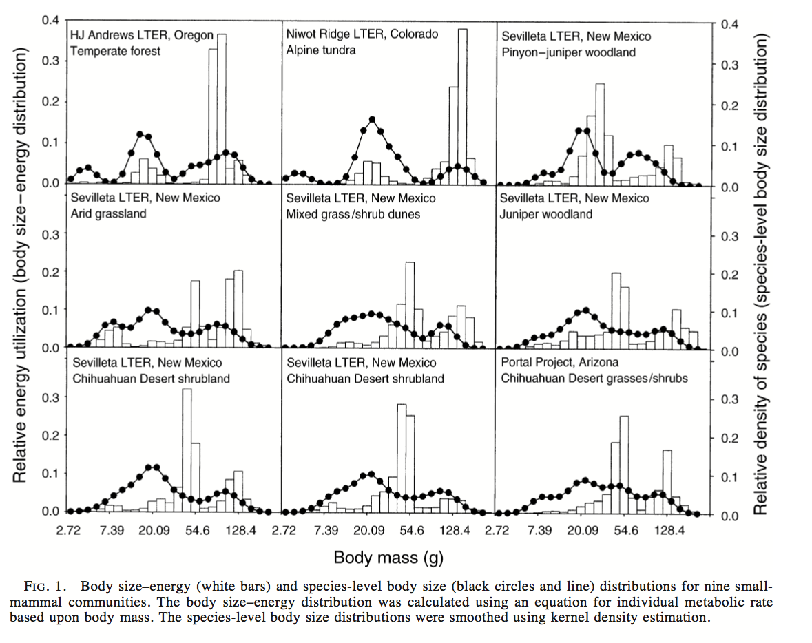

```{r setup, include = F}
library(replicatebecs)
source_sims = FALSE
set.seed(352) # GNV area code, for fun
```


A walkthrough of Ernest (2005)'s original analytical approach, from close reading of the paper.

## Questions

1. Is energy use across body size categories (regardless of species) uniform or multimodal?
- uniform would correspond generally to energetic equivalence/Damuth's rule.
- multimodal might suggest different resource availability for different body sizes.
2. If energy use is not uniform across body size categories, does the species level body size distribution correspond to modes of energy use?
- i.e. are there more species with mean body sizes around the modes of the body size-energy use distribution?
- if so, maybe it's good to be certain sizes, and species accumulate at those optima.


## Data

#### Ernest data
Ernest drew data from the Andrews LTER, the Sevilleta, Niwot Ridge, and Portal. For details of these field sites, see the _relevant publications cited in Ernest (2005)._

#### Translation to `replicate-becs`

The same datasets are available online, _from these sources_.

Rather than download them through the host websites, they are included in `replicate-becs`. (To download them from their original hosts, use `from_url = TRUE`.) By default they will be stored in `replicate-becs/working-data/paper/raw`. 

```{r download raw data}
download_raw_paper_data(from_url = FALSE)
```

Process raw data into the appropriate format. This is a data table with a record for each individual and columns for `species` and `weight` in grams. By default these tables will be stored in subdirectores of `replicate-becs/working-data/paper/processed`.

```{r process paper data}
process_raw_data()
```


Load data tables for each community.

```{r load community data, echo=TRUE}
communities <- load_paper_data()
```

Each community is a named data table with columns for species and size for each individual, for example:

```{r inspect community data}
names(communities)[[1]]
head(communities[[1]])
```

#### Comparing data from 2005 to data available in 2019

Although the same datasets are now available online, they may have changed somewhat since 2005 (due to error checking, etc). Ernest (2005) may also have taken some cleaning and filtering steps, the details of which could have been omitted from the manuscript due to length restrictions. For example, many studies using data from the Portal Project omit ground squirrels, because although they may be within the "small mammal" size range, they are not target taxa for the sampling method.

Ernest (2005) reported summary statistics of her datasets; here I compare them to the corresponding dataset in the 2019 data.

```{r compare summary stats}
summary_stats_comparison = compare_summary_stats()

print(summary_stats_comparison)
```

## Constructing distributions/metrics

### Body size-energy use distributions (BSED)

#### Ernest method

- Per individual, calculate metabolic rate as metabolic rate $B \propto M^\frac{3}{4}$ where $M$ is mass in grams.
- Sum energy use of all individuals in body size classes of .2 natural log units.
- Also try classes of .1 and .3 natural log units
- Convert raw energy use values for each body size class into the proportion of all the energy used in that community used by that body size class. This allows for comparisons between communities.

```{r copy Figure 1, include = F} 
file.copy(file.path(system.file(package= "replicatebecs"), "data", "ernest-2005-files", "ernest2005_fig1.png"), here::here("report"))
```




#### Translation to `replicate-becs`

For every individual, calculate metabolic rate and assign to a size class.

```{r construct BSEDs}
communities_energy <- lapply(communities, FUN = add_energy_sizeclass, ln_units = 0.2)

head(communities_energy[[1]])
```

For each community, sum total energy use for each size class, and convert to the proportion of total energy use for that community.

```{r make bseds}
bseds <- lapply(communities_energy, FUN = make_bsed)

head(bseds[[1]])
```

```{r plot bseds, echo=FALSE, fig.height=10, fig.width=10}

bseds_plot <- plot_paper_dists(bseds, dist_type = 'bsed')

invisible(bseds_plot)
```


### Species-level body size distributions (BSD)

#### Ernest method
- Frequency distributions of mean mass of each species in a community.
- For plotting (but not statistics), smoothed using kernel density estimation.
- Gaussian kernel to mimic the actual body size distribution in log space
- avg. std dev of the mean of the logged masses = smoothing parameter $h$
- align sampling points with the midpoint of each size class in the BSED
- after Manly 1996, "Are there clumps in body-size distributions?", _Ecology_

#### Translation to `replicate-becs`

Calculate mean mass of each species in each community.

```{r construct bsds}

bsds <- lapply(communities, FUN = make_bsd)

head(bsds[[1]])
```

```{r plot bsds, echo=FALSE, fig.height=10, fig.width=10}

bsds_plot <- plot_paper_dists(bsds, dist_type = 'bsd')

invisible(bsds_plot)
```


### Energetic dominance ($D_E$)

- Define "energy use modes" as contiguous body size classes where the energy use of each size class > 5% of the community total.
- i.e. a little bit more than the expectation if energy use is uniform across all body sizes
- Calculate the total energy use for each species in the mode.
- Calculate the "dominance" of the species with the highest energy use in that mode as $D_E = p_{max}$, where $p_{max}$ is the maximum proportion of energy use by any one species in a mode.
- "a modification of the Berger-Parker dominance index (Berger and Parker 1970)"

#### Translation to `replicate-becs`

- Find contiguous size classes where each class has >5% of total energy use
- Calculate the total energy use for each species, and the proportion held by the species with the highest energy use ($p_{max}$)
- Return $p_{max}$ for every mode, along with the min and max size classes in that mode for each community

```{r energetic dominance}

energetic_dom <- lapply(communities_energy, FUN = energetic_dominance)

head(energetic_dom[[1]])

```

- To plot, combine all modes from all communities and plot a histogram of $D_E$ values.

```{r plot Ed, echo=FALSE, fig.height=5, fig.width=5}
e_dom_plot <- plot_e_dom(energetic_dom)
e_dom_plot
```

